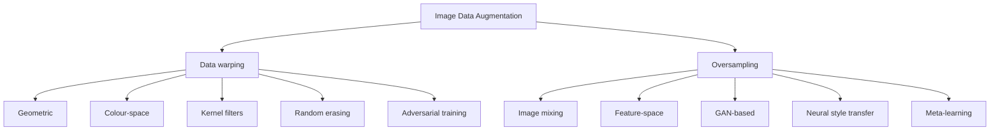

# Image Data Augmentation for Deep Learning: A Technical Review

**Student:** Dinakar Nayak N  
**Module:** CO7091 — Computational Intelligence and Software Engineering  
**Assessment:** Technology Review  
**Primary source:** Shorten and Khoshgoftaar (2019)  
**Date:** October 2026

## Scope and evidence note

This review is based principally on Shorten and Khoshgoftaar's peer-reviewed survey of image data augmentation for deep learning. The accompanying implementation repository is treated as a research companion: it demonstrates selected image-space augmentation operations and experimental diagnostics, but it does not claim to reproduce every method or numerical result reported in the survey. Literature results and newly generated repository measurements are therefore kept explicitly separate.

## 1. Introduction

Deep convolutional neural networks (CNNs) have transformed computer vision by learning hierarchical representations directly from image data. However, their high representational capacity creates a fundamental statistical problem: when training data are insufficient, a network may minimise empirical training error without learning representations that generalise to unseen observations. This manifests as **overfitting**, characterised by a divergence between training and validation/test performance. The problem is particularly consequential in domains where acquiring and expert-labelling sufficiently large datasets is expensive, time-consuming, or constrained by limited examples.

Image data augmentation addresses this limitation at the data level by constructing additional training observations from existing samples. Rather than simply increasing dataset cardinality, effective augmentation seeks to encode plausible invariances to transformations such as viewpoint, illumination, translation and occlusion. Shorten and Khoshgoftaar distinguish augmentation principally through **data warping**, which transforms existing observations while attempting to preserve their labels, and **oversampling**, which constructs additional synthetic instances.

Consequently, augmentation can be understood not merely as preprocessing, but as an implicit mechanism for shaping the distribution from which a learning algorithm acquires its decision boundary. Its effectiveness is therefore conditional on whether the generated examples remain semantically valid and represent plausible variation in the target domain.

## 2. State-of-the-Art Technologies

Shorten and Khoshgoftaar organise image augmentation into ten broad approaches:

1. **Geometric transformations** — flipping, cropping, rotation and translation. These expose classifiers to plausible spatial variation, but transformations must preserve task semantics.
2. **Colour-space transformations** — brightness, colour and illumination changes. They can improve robustness to photometric variation, but colour may itself be discriminative.
3. **Kernel filters** — blurring, sharpening and local filtering. These expose models to image-quality variation, although strong filtering may create unrealistic samples.
4. **Image mixing** — combines information from multiple images to create new observations; semantic or label ambiguity can arise.
5. **Random erasing** — removes selected image regions and can improve robustness to occlusion, but may remove task-critical information.
6. **Feature-space augmentation** — manipulates learned representations rather than raw pixels; effectiveness depends on the learned representation.
7. **Adversarial training** — introduces perturbations intended to expose weaknesses in a model's decision boundary, at additional optimisation cost.
8. **GAN-based augmentation** — uses generative models to synthesise examples; useful synthetic data can be produced, but training is computationally demanding.
9. **Neural style transfer** — changes visual style while attempting to preserve content; excessive style changes may affect task information.
10. **Meta-learning** — treats augmentation-policy selection as an optimisation problem and can learn policies, but requires additional optimisation.

At a higher level, these approaches can be interpreted through **data warping**, which modifies existing observations, and **oversampling**, which generates additional instances. The progression is therefore from manually specified image transformations toward learned and adaptive augmentation mechanisms.

### Conceptual taxonomy

## 3. Performance Evaluation

The survey provides empirical evidence that augmentation can materially alter predictive performance, but the results should not be interpreted as evidence of a universally optimal augmentation method.

| Technique | Dataset/task | Reported comparison |
|---|---|---|
| Cropping | Caltech101 | 48.13% → 61.95% top-1 |
| SamplePairing | CIFAR-10 | 8.22% → 6.93% error |
| Random erasing | CIFAR-10 | 5.17% → 4.31% error |
| GAN augmentation | Liver lesions | Sensitivity 78.6% → 85.7% |
| GAN augmentation | Liver lesions | Specificity 88.4% → 92.4% |

These results originate from different datasets, model configurations and experimental conditions. Consequently, direct cross-technique ranking would be inappropriate. The survey itself notes that relatively few studies directly compared augmentation approaches under common conditions. This limits the extent to which isolated accuracy improvements can be generalised across tasks.

The accompanying repository uses a deliberately narrower evidence boundary. Its interactive laboratory implements geometric, colour-space, kernel-filter and random-erasing operations and provides MSE, MAE, PSNR, histogram-distance and edge-density diagnostics. These measurements quantify **image-space change**; they do not establish semantic validity, label preservation, classification accuracy or improved CNN generalisation.

A further limitation is that augmentation does not automatically correct deficiencies in the original dataset. If source data contain systematic bias, missing classes, or a distribution that is poorly representative of deployment conditions, transformed versions may reproduce rather than solve the underlying problem. Remaining questions include augmentation amount, combinations of methods, test-time augmentation, image resolution, curriculum learning and learned augmentation policies.

## 4. Conclusion

Image data augmentation provides a principled mechanism for mitigating the consequences of limited training data by modifying or expanding the empirical distribution available to a learning algorithm. The survey demonstrates a progression from manually engineered transformations, such as cropping and flipping, toward learned mechanisms based on feature representations, adversarial optimisation, generative models, neural style transfer and meta-learning.

Reported experiments indicate that augmentation can reduce classification error and improve predictive performance, but the magnitude and reliability of these benefits remain dependent on the dataset, task, model and transformation policy.

The principal unresolved issue is how to determine which transformations, magnitudes, combinations and dataset sizes are appropriate for a particular learning problem. Augmentation can also reproduce biases present in source data rather than eliminate them.

Future work should emphasise data-aware and automatically optimised augmentation policies evaluated under controlled experimental conditions. Repeated seeds, isolated test sets, confidence intervals, task-specific metrics and ablation studies are necessary to establish whether an augmentation strategy produces a statistically and practically meaningful improvement.

## Research Companion and Reproducibility

The accompanying repository contains an interactive Streamlit laboratory, a Google Colab notebook, experiment infrastructure, diagnostics and documentation.

Implemented image-space techniques include:

- horizontal and vertical flipping;
- rotation, translation and shear;
- crop and resize;
- brightness, contrast and saturation changes;
- grayscale, inversion, solarization and posterization;
- blur, Gaussian blur, sharpening and edge filters;
- random erasing;
- stochastic multi-stage augmentation policies;
- sensitivity analysis;
- controlled experiment matrices; and
- reproducibility metadata and CSV/JSON export.

The repository explicitly distinguishes between literature evidence, reproduction and experimental extension. Its policy-search component is an engineering extension and should not be represented as a reproduction of AutoAugment or as a reproduction of the survey's numerical experiments.

### Experimental interpretation boundary

For rigorous downstream performance evaluation, the image-level laboratory should be followed by a controlled machine-learning experiment preserving an isolated test set and reporting the dataset, model architecture, augmentation policy, random seeds, software versions, training configuration, evaluation metrics, number of repetitions and uncertainty estimates.

> **Image change ≠ semantic validity ≠ improved generalisation.**

## References

1. C. Shorten and T. M. Khoshgoftaar, “A survey on Image Data Augmentation for Deep Learning,” *Journal of Big Data*, vol. 6, article 60, 2019. DOI: https://doi.org/10.1186/s40537-019-0197-0.
2. D. Nayak, *Image Data Augmentation — Research Companion*, GitHub repository, 2026. https://github.com/Dinakarnayak/Image-Data-Augmentation-Tech-Review.

## Repository

https://github.com/Dinakarnayak/Image-Data-Augmentation-Tech-Review
